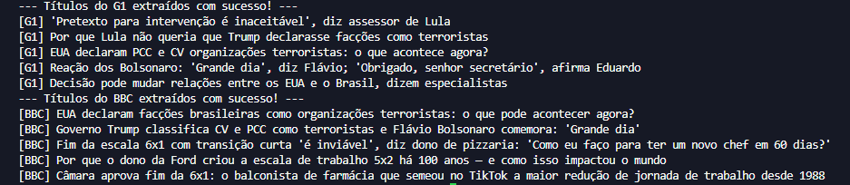

# 🌐 Web Scraper em Python

Projeto desenvolvido em Python para praticar técnicas básicas de Web Scraping, permitindo coletar informações de páginas web de forma automatizada.

---

## 📚 Sobre o Projeto

Este projeto realiza a extração de dados de páginas da internet utilizando bibliotecas Python especializadas para requisições HTTP e análise de conteúdo HTML.

O objetivo é compreender como aplicações podem coletar e processar informações disponíveis publicamente em sites de forma automatizada.

---

## 🚀 Tecnologias Utilizadas

* Python 3
* Requests
* BeautifulSoup4

---

## 🎯 Objetivos de Aprendizagem

Durante o desenvolvimento deste projeto foram praticados os seguintes conceitos:

* Requisições HTTP
* Web Scraping
* Manipulação de HTML
* Extração de dados
* Tratamento de erros
* Organização de código
* Automação de tarefas

---

## ⚠️ Aviso

Este projeto foi desenvolvido exclusivamente para fins educacionais.

A coleta de dados deve sempre respeitar os Termos de Uso dos sites acessados, bem como boas práticas de utilização da web.

---

## 📸 Screenshots


### ✅ Resultado da Execução



---

## ▶️ Como Executar

### 1. Clone o repositório

```bash id="1a9g6m"
git clone <https://github.com/Lucksander/Webscraper-Python>
```

### 2. Instale as dependências

```bash id="mz40ow"
pip install requests beautifulsoup4
```

### 3. Execute o programa

```bash id="s9u6z4"
python webscraper.py
```

---

## 📁 Estrutura do Projeto

```text id="qmbmde"
webscraper-python/
│
├── README.md
├── webscraper.py
├── assets/
   └── resultado_execucao.png


```

---

## 📌 Funcionalidades

* Realizar requisições para páginas web
* Ler e interpretar código HTML
* Extrair informações específicas
* Exibir os dados coletados
* Tratar possíveis erros de conexão

---

## 🔮 Melhorias Futuras

* Exportação para CSV
* Exportação para Excel
* Interface gráfica com Tkinter
* Coleta de múltiplas páginas
* Armazenamento em banco de dados
* Agendamento automático de coletas

---

## 👨‍💻 Autor

Lucas Santos
Estudante de Análise e Desenvolvimento de Sistemas
